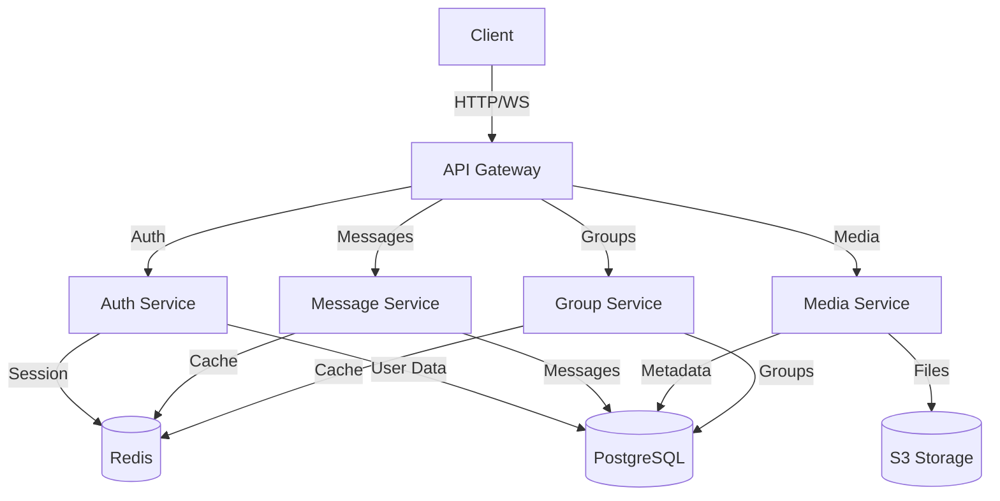
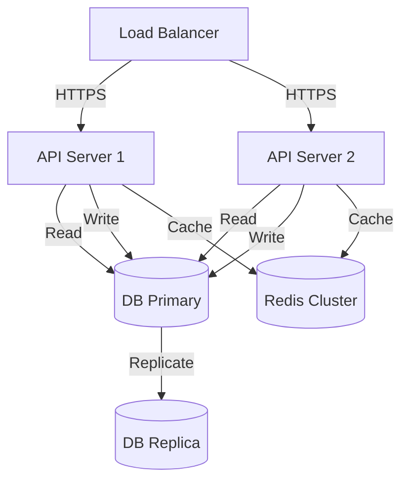

# System Architecture

## Overview

The messaging application is built using a microservices architecture with the following key components:

### Core Components

1. **Backend Service (Rust)**
   - REST API server
   - WebSocket server
   - Message processing
   - Authentication
   - Rate limiting

2. **Frontend Service (React)**
   - User interface
   - Real-time updates
   - Media handling
   - State management

3. **Database (PostgreSQL)**
   - User data
   - Messages
   - Groups
   - Media metadata

4. **Cache Layer (Redis)**
   - Session management
   - Rate limiting
   - Real-time presence
   - Message queue

5. **Media Storage (S3)**
   - File storage
   - CDN integration
   - Backup storage

## System Design

### High-Level Architecture



### Component Interactions

1. **Authentication Flow**
   ```mermaid
   sequenceDiagram
       Client->>+API: Login Request
       API->>+Auth: Validate Credentials
       Auth->>+DB: Check User
       DB-->>-Auth: User Data
       Auth->>+Redis: Store Session
       Redis-->>-Auth: Session ID
       Auth-->>-API: JWT Token
       API-->>-Client: Auth Response
   ```

2. **Message Flow**
   ```mermaid
   sequenceDiagram
       Client->>+API: Send Message
       API->>+Msg: Process Message
       Msg->>+DB: Store Message
       DB-->>-Msg: Message ID
       Msg->>+Redis: Cache Message
       Redis-->>-Msg: Cache Status
       Msg->>+WS: Broadcast
       WS-->>-Client: Real-time Update
   ```

## Data Models

### User Model
```rust
struct User {
    id: Uuid,
    username: String,
    email: String,
    password_hash: String,
    created_at: DateTime<Utc>,
    updated_at: DateTime<Utc>,
    last_login: Option<DateTime<Utc>>,
    status: UserStatus,
    settings: UserSettings,
}
```

### Message Model
```rust
struct Message {
    id: Uuid,
    sender_id: Uuid,
    receiver_id: Uuid,
    content: String,
    type_: MessageType,
    status: MessageStatus,
    created_at: DateTime<Utc>,
    updated_at: DateTime<Utc>,
    metadata: MessageMetadata,
}
```

### Group Model
```rust
struct Group {
    id: Uuid,
    name: String,
    description: Option<String>,
    owner_id: Uuid,
    created_at: DateTime<Utc>,
    updated_at: DateTime<Utc>,
    settings: GroupSettings,
    members: Vec<GroupMember>,
}
```

## Security Architecture

### Authentication
- JWT-based authentication
- Refresh token rotation
- Rate limiting per endpoint
- IP-based blocking
- Session management

### Authorization
- Role-based access control
- Resource ownership validation
- Group permission system
- API key management

### Data Protection
- End-to-end encryption for messages
- Media encryption at rest
- Secure password hashing
- Input validation
- XSS protection
- CSRF protection

## Scalability Considerations

### Horizontal Scaling
- Stateless API design
- Database sharding strategy
- Redis cluster configuration
- Load balancer setup
- CDN integration

### Performance Optimization
- Database indexing strategy
- Query optimization
- Caching strategy
- Connection pooling
- Background job processing

### Monitoring and Alerts
- Performance metrics
- Error tracking
- Resource utilization
- Business metrics
- Security events

## Deployment Architecture

### Production Environment


### Development Environment
- Local development setup
- Docker Compose configuration
- CI/CD pipeline
- Testing environment
- Staging environment

## Disaster Recovery

### Backup Strategy
- Database backups
- Media backups
- Configuration backups
- Log retention

### Recovery Procedures
- Database restore
- Service recovery
- Data migration
- Rollback procedures

## Compliance

### Data Privacy
- GDPR compliance
- Data retention policies
- User data export
- Data deletion

### Security Standards
- OWASP guidelines
- Security best practices
- Regular audits
- Penetration testing

## Future Considerations

### Planned Improvements
- Message encryption
- Voice/video calls
- File sharing
- Group features
- Analytics

### Technical Debt
- Code refactoring
- Performance optimization
- Documentation updates
- Test coverage 